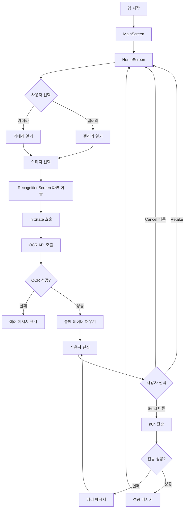
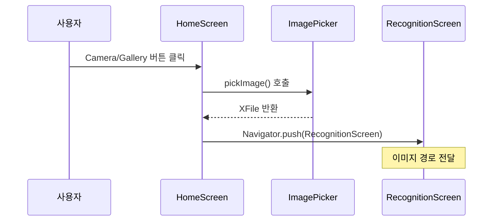
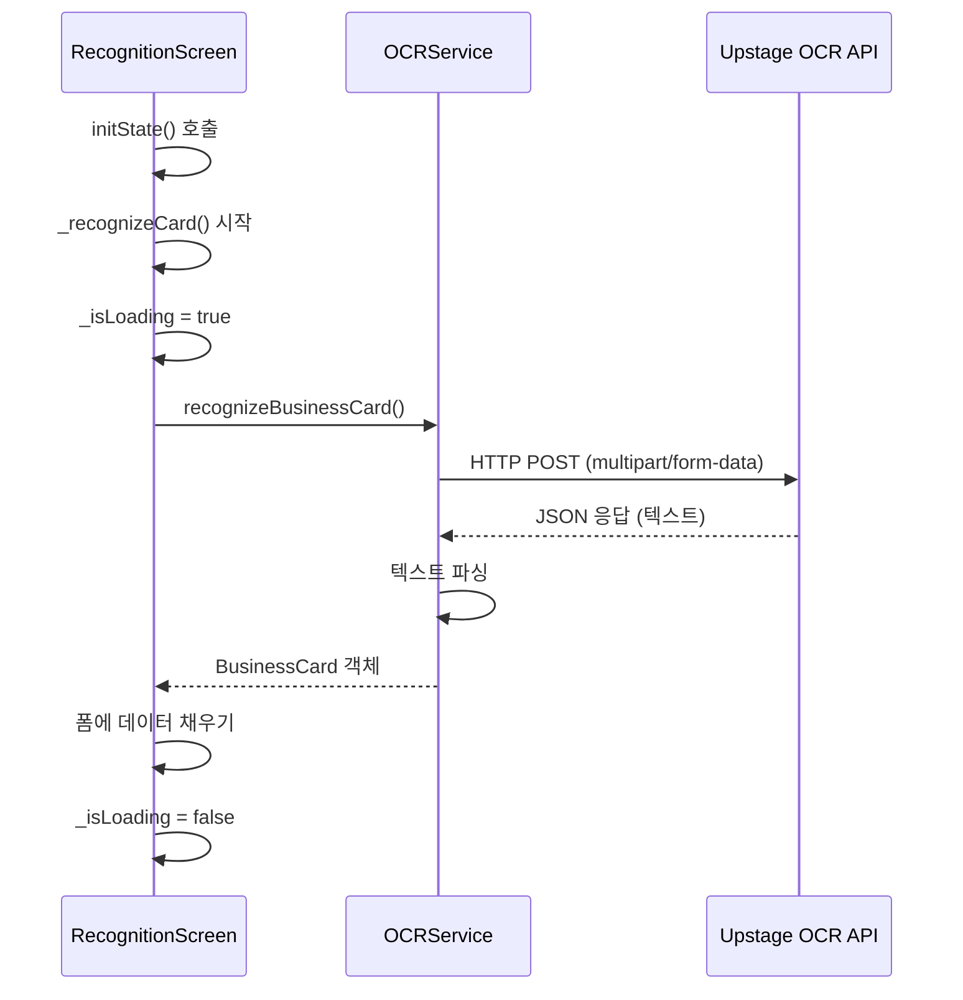
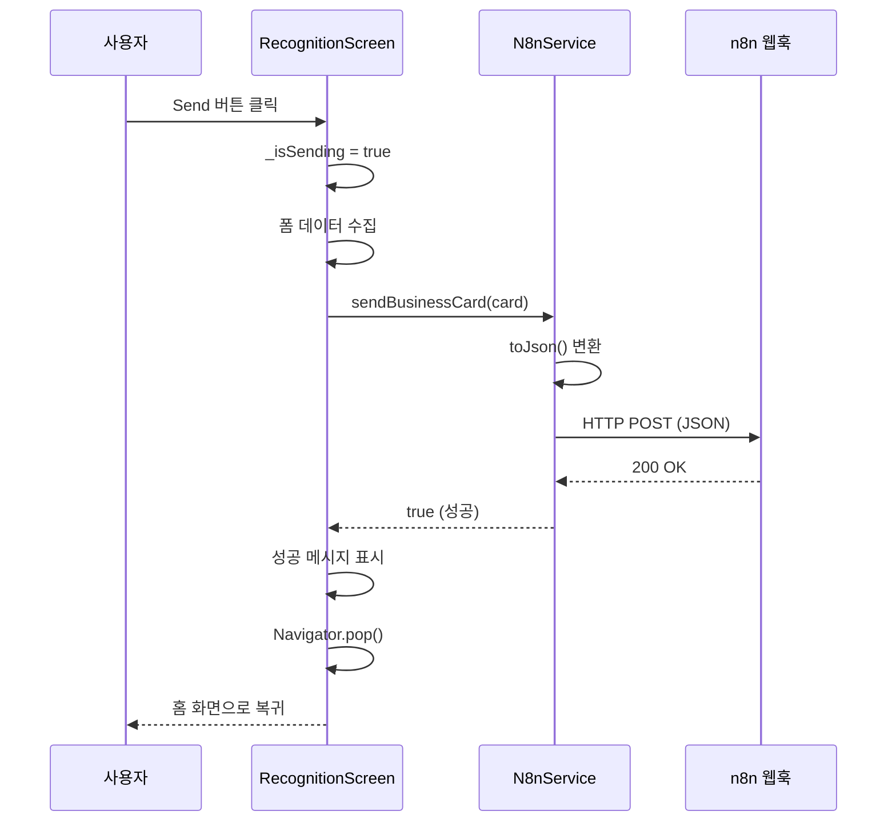
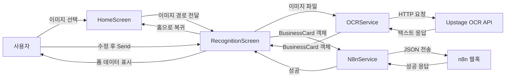

# 명함 인식 앱 UX 흐름 가이드

Flutter 초보자를 위한 전체 사용자 경험(UX) 흐름과 소스 코드 설명서입니다.

## 📋 목차

1. [전체 앱 흐름 개요](#전체-앱-흐름-개요)
2. [앱 시작 및 초기화](#1-앱-시작-및-초기화)
3. [홈 화면 - 이미지 선택](#2-홈-화면---이미지-선택)
4. [명함 인식 화면 - OCR 처리](#3-명함-인식-화면---ocr-처리)
5. [명함 정보 편집](#4-명함-정보-편집)
6. [n8n 전송 및 완료](#5-n8n-전송-및-완료)
7. [주요 컴포넌트 설명](#주요-컴포넌트-설명)

---

## 전체 앱 흐름 개요



---

## 1. 앱 시작 및 초기화

### 1.1 앱 진입점 (main.dart)

앱이 시작되면 `main()` 함수가 호출되고, 환경변수를 로드한 후 `MyApp` 위젯이 생성됩니다.

```dart
// lib/main.dart
Future<void> main() async {
  WidgetsFlutterBinding.ensureInitialized();

  // .env 파일 로드 (웹과 모바일 모두 지원)
  try {
    await dotenv.load(fileName: '.env');
  } catch (e) {
    debugPrint('경고: .env 파일을 로드할 수 없습니다: $e');
  }

  runApp(const MyApp());
}
```

**설명:**
- `main()`: Flutter 앱의 진입점
- `async`: 비동기 함수로 선언 (환경변수 로드가 비동기 작업)
- `WidgetsFlutterBinding.ensureInitialized()`: Flutter 위젯 바인딩 초기화 (비동기 작업 전 필요)
- `dotenv.load()`: `.env` 파일에서 환경변수 로드
- `runApp()`: 루트 위젯을 지정하여 앱을 실행

### 1.2 앱 테마 설정

```dart
class MyApp extends StatelessWidget {
  const MyApp({super.key});

  @override
  Widget build(BuildContext context) {
    return MaterialApp(
      title: 'Business Card Recognition',
      theme: ThemeData(
        colorScheme: ColorScheme.dark(
          primary: const Color(Constants.accentYellow),  // 노란색 강조
          background: const Color(Constants.primaryBlack),  // 검은 배경
          surface: const Color(Constants.primaryBlack),
        ),
        scaffoldBackgroundColor: const Color(Constants.primaryBlack),
        // ... 기타 테마 설정
      ),
      home: const MainScreen(),  // 첫 화면으로 MainScreen 설정
    );
  }
}
```

**설명:**
- `MaterialApp`: Material Design 앱의 기본 구조 제공
- `ThemeData`: 앱 전체의 색상, 폰트 등 테마 설정
- `home`: 앱이 시작될 때 보여줄 화면

### 1.3 메인 화면 및 네비게이션

```dart
class _MainScreenState extends State<MainScreen> {
  int _currentIndex = 0;  // 현재 선택된 탭 인덱스

  final List<Widget> _screens = [
    const HomeScreen(),      // 홈 화면
    const HistoryScreen(),    // 히스토리 화면
    const SettingsScreen(),  // 설정 화면
  ];

  void _onTabTapped(int index) {
    setState(() {
      _currentIndex = index;  // 선택된 탭 인덱스 업데이트
    });
  }

  @override
  Widget build(BuildContext context) {
    return Scaffold(
      body: _screens[_currentIndex],  // 현재 선택된 화면 표시
      bottomNavigationBar: BottomNavBar(
        currentIndex: _currentIndex,
        onTap: _onTabTapped,  // 탭 클릭 시 호출
      ),
    );
  }
}
```

**설명:**
- `StatefulWidget`: 상태를 가진 위젯 (현재 선택된 탭 인덱스)
- `setState()`: 상태 변경 시 UI를 다시 그리도록 알림
- `_screens`: 각 탭에 해당하는 화면 리스트
- `BottomNavBar`: 하단 네비게이션 바 (Home, History, Settings)

**흐름:**
1. 앱 시작 → `MainScreen` 표시
2. 기본적으로 `HomeScreen`이 표시됨 (인덱스 0)
3. 하단 네비게이션 바에서 탭 선택 시 `_onTabTapped()` 호출
4. `setState()`로 `_currentIndex` 변경
5. 변경된 인덱스에 해당하는 화면 표시

---

## 2. 홈 화면 - 이미지 선택

### 2.1 홈 화면 구조

```dart
class HomeScreen extends StatefulWidget {
  const HomeScreen({super.key});

  @override
  State<HomeScreen> createState() => _HomeScreenState();
}
```

**설명:**
- `StatefulWidget`: 사용자 상호작용에 따라 상태가 변경되는 화면

### 2.2 이미지 선택 함수

```dart
Future<void> _pickImage(ImageSource source) async {
  try {
    final ImagePicker picker = ImagePicker();
    final XFile? image = await picker.pickImage(
      source: source,
      imageQuality: 85,
    );

    if (image != null && mounted) {
      // 웹에서는 이미지 바이트를 읽어서 전달
      Uint8List? imageBytes;
      if (kIsWeb) {
        imageBytes = await image.readAsBytes();
      }

      Navigator.push(
        context,
        MaterialPageRoute(
          builder: (context) => RecognitionScreen(
            imagePath: image.path,
            imageBytes: imageBytes,
          ),
        ),
      );
    }
  } catch (e) {
    if (mounted) {
      ScaffoldMessenger.of(context).showSnackBar(
        SnackBar(
          content: Text('이미지 선택 중 오류가 발생했습니다: ${e.toString()}'),
          backgroundColor: Colors.red,
          duration: const Duration(seconds: 3),
        ),
      );
    }
  }
}
```

**설명:**
- `async/await`: 비동기 작업 처리 (이미지 선택은 시간이 걸림)
- `ImagePicker`: 카메라 또는 갤러리에서 이미지를 선택하는 패키지
- `ImageSource.camera`: 카메라 사용
- `ImageSource.gallery`: 갤러리 사용
- `kIsWeb`: 웹 플랫폼인지 확인하는 상수
- `image.readAsBytes()`: 웹에서 이미지 바이트 데이터 읽기 (웹에서는 `Image.file`이 지원되지 않음)
- `Navigator.push()`: 새로운 화면으로 이동 (스택에 쌓임)
- `mounted`: 위젯이 아직 화면에 있는지 확인 (비동기 작업 후 체크 필요)
- `try-catch`: 에러 처리 (이미지 선택 실패 시 사용자에게 알림)

### 2.3 홈 화면 UI

```dart
@override
Widget build(BuildContext context) {
  return Scaffold(
    backgroundColor: const Color(Constants.primaryBlack),  // 검은 배경
    appBar: AppBar(
      title: const Text('Business Card Recognition'),
    ),
    body: Center(
      child: Column(
        mainAxisAlignment: MainAxisAlignment.center,
        children: [
          // 원형 이미지 플레이스홀더
          Container(
            width: 200,
            height: 200,
            decoration: BoxDecoration(
              shape: BoxShape.circle,  // 원형
              color: Colors.grey[900],
            ),
            child: Icon(Icons.business_center),
          ),
          
          // 카메라 버튼
          ElevatedButton(
            onPressed: () => _pickImage(ImageSource.camera),
            child: const Text('Camera'),
          ),
          
          // 갤러리 버튼
          ElevatedButton(
            onPressed: () => _pickImage(ImageSource.gallery),
            child: const Text('Gallery'),
          ),
        ],
      ),
    ),
  );
}
```

**흐름:**
1. 사용자가 "Camera" 또는 "Gallery" 버튼 클릭
2. `_pickImage()` 함수 호출
3. 이미지 선택 대화상자 또는 카메라 열림
4. 이미지 선택 완료
5. `RecognitionScreen`으로 이동하며 이미지 경로 전달



---

## 3. 명함 인식 화면 - OCR 처리

### 3.1 RecognitionScreen 초기화

```dart
class RecognitionScreen extends StatefulWidget {
  final String imagePath;      // 이미지 경로 (모바일용)
  final Uint8List? imageBytes; // 이미지 바이트 데이터 (웹용)

  const RecognitionScreen({
    super.key,
    required this.imagePath,
    this.imageBytes,
  });

  @override
  State<RecognitionScreen> createState() => _RecognitionScreenState();
}
```

**설명:**
- `imagePath`: 모바일(iOS/Android)에서 사용하는 파일 경로
- `imageBytes`: 웹에서 사용하는 이미지 바이트 데이터
- 웹과 모바일을 모두 지원하기 위해 두 가지 파라미터를 받음

### 3.2 initState - 화면 진입 시 자동 실행

```dart
@override
void initState() {
  super.initState();
  _recognizeCard();  // 화면이 로드되면 자동으로 OCR 실행
}
```

**설명:**
- `initState()`: 위젯이 생성될 때 한 번만 실행되는 생명주기 메서드
- 화면이 표시되면 자동으로 OCR 인식 시작

### 3.3 OCR 인식 함수

```dart
Future<void> _recognizeCard() async {
  // 로딩 상태 시작
  setState(() {
    _isLoading = true;
  });

  try {
    // OCR 서비스를 통해 명함 인식 (웹/모바일 모두 지원)
    final card = await OCRService.recognizeBusinessCard(
      widget.imagePath,
      imageBytes: widget.imageBytes,
    );
    
    // 인식된 데이터를 폼에 채우기
    setState(() {
      _nameController.text = card.name ?? '';
      _emailController.text = card.email ?? '';
      _phoneController.text = card.phone ?? '';
      _companyController.text = card.company ?? '';
      _positionController.text = card.position ?? '';
      _websiteController.text = card.website ?? '';
      _addressController.text = card.address ?? '';
      _isLoading = false;  // 로딩 완료
    });
  } catch (e) {
    // 에러 발생 시 로딩 중지 및 에러 메시지 표시
    setState(() {
      _isLoading = false;
    });
    if (mounted) {
      ScaffoldMessenger.of(context).showSnackBar(
        SnackBar(
          content: Text('OCR 인식 실패: $e'),
          backgroundColor: Colors.red,
        ),
      );
    }
  }
}
```

**설명:**
- `setState()`: 상태 변경 시 UI 업데이트
- `_isLoading`: 로딩 상태 관리 (로딩 중에는 CircularProgressIndicator 표시)
- `TextEditingController`: 텍스트 필드의 값을 제어하는 컨트롤러
- `try-catch`: 에러 처리
- `ScaffoldMessenger`: 화면 하단에 메시지 표시

### 3.4 OCR 서비스 구현

```dart
// lib/services/ocr_service.dart
class OCRService {
  static Future<BusinessCard> recognizeBusinessCard(
    String imagePath, {
    Uint8List? imageBytes,
  }) async {
    try {
      // Multipart 요청 생성 (파일 업로드용)
      final request = http.MultipartRequest(
        'POST',
        Uri.parse(Constants.upstageApiEndpoint),
      );
      
      // API 키를 헤더에 추가 (환경변수에서 로드)
      request.headers['Authorization'] = 'Bearer ${Constants.upstageApiKey}';
      
      // 웹에서는 바이트 데이터 사용, 모바일에서는 파일 경로 사용
      if (kIsWeb) {
        if (imageBytes == null) {
          throw Exception('웹 환경에서는 이미지 바이트 데이터가 필요합니다.');
        }
        request.files.add(
          http.MultipartFile.fromBytes(
            'document',
            imageBytes,
            filename: 'image.jpg',
          ),
        );
      } else {
        // 모바일(iOS/Android)에서는 파일 경로 사용
        final file = File(imagePath);
        if (!await file.exists()) {
          throw Exception('이미지 파일을 찾을 수 없습니다: $imagePath');
        }
        request.files.add(
          await http.MultipartFile.fromPath('document', file.path),
        );
      }
      
      // 모델 지정
      request.fields['model'] = 'ocr';

      // 요청 전송 및 응답 받기
      final streamedResponse = await request.send();
      final response = await http.Response.fromStream(streamedResponse);

      if (response.statusCode == 200) {
        final data = jsonDecode(response.body);
        return _parseOCRResponse(data);  // 응답 파싱
      } else {
        throw Exception('OCR API 호출 실패: ${response.statusCode}');
      }
    } catch (e) {
      throw Exception('OCR 인식 중 오류 발생: $e');
    }
  }
}
```

**설명:**
- `MultipartRequest`: 파일 업로드를 위한 HTTP 요청 형식
- `Constants.upstageApiKey`: 환경변수에서 로드된 API 키
- `kIsWeb`: 웹 플랫폼 확인
- `MultipartFile.fromBytes()`: 웹에서 바이트 데이터를 요청에 첨부
- `MultipartFile.fromPath()`: 모바일에서 파일 경로를 요청에 첨부
- `Authorization` 헤더: API 인증을 위한 키
- `jsonDecode()`: JSON 문자열을 Dart 객체로 변환

**흐름:**
1. 이미지 경로 또는 바이트 데이터 받기 (플랫폼에 따라 다름)
2. HTTP Multipart 요청 생성
3. 웹/모바일 분기 처리:
   - 웹: 바이트 데이터를 `MultipartFile.fromBytes()`로 첨부
   - 모바일: 파일 경로를 `MultipartFile.fromPath()`로 첨부
4. Upstage OCR API에 요청 전송 (환경변수에서 로드된 API 키 사용)
5. 응답 받기 (텍스트 데이터)
6. 텍스트에서 명함 정보 추출 (정규식, 키워드 매칭)
7. BusinessCard 객체로 반환



### 3.5 이미지 표시 (웹/모바일 분기)

```dart
// 웹에서는 Image.memory 사용, 모바일에서는 Image.file 사용
child: ClipOval(
  child: kIsWeb
      ? (widget.imageBytes != null
          ? Image.memory(
              widget.imageBytes!,
              fit: BoxFit.cover,
            )
          : Icon(Icons.image))
      : Image.file(
          File(widget.imagePath),
          fit: BoxFit.cover,
        ),
),
```

**설명:**
- `kIsWeb`: 웹 플랫폼인지 확인
- `Image.memory`: 웹에서 바이트 데이터로 이미지 표시
- `Image.file`: 모바일에서 파일 경로로 이미지 표시
- 웹에서는 `Image.file`이 지원되지 않으므로 `Image.memory` 사용

### 3.6 텍스트 파싱 (OCR 응답 처리)

```dart
static BusinessCard _parseOCRResponse(Map<String, dynamic> data) {
  // API 응답에서 텍스트 추출
  final text = data['text'] ?? '';
  final pages = data['pages'] as List<dynamic>?;
  
  // 모든 페이지의 텍스트 합치기
  String fullText = text;
  if (pages != null && pages.isNotEmpty) {
    final pageTexts = pages.map((page) => page['text'] as String? ?? '').toList();
    fullText = pageTexts.join('\n');
  }

  // 정규식과 키워드로 각 필드 추출
  return BusinessCard(
    name: _extractName(fullText),
    email: _extractEmail(fullText),
    phone: _extractPhone(fullText),
    company: _extractCompany(fullText),
    position: _extractPosition(fullText),
    website: _extractWebsite(fullText),
    address: _extractAddress(fullText),
  );
}

// 이메일 추출 예시
static String? _extractEmail(String text) {
  final emailRegex = RegExp(r'([a-zA-Z0-9._%+-]+@[a-zA-Z0-9.-]+\.[a-zA-Z]{2,})');
  final match = emailRegex.firstMatch(text);
  return match?.group(1);
}
```

**설명:**
- 정규식(RegExp): 텍스트에서 패턴 매칭 (이메일, 전화번호 등)
- 키워드 매칭: 회사명, 직책 등은 키워드로 찾기

---

## 4. 명함 정보 편집

### 4.1 폼 필드 표시

```dart
// 로딩 중이 아니면 폼 필드 표시
if (_isLoading)
  const CircularProgressIndicator()  // 로딩 중
else ...[
  // Name과 Company 필드 (나란히)
  Row(
    children: [
      Expanded(
        child: TextField(
          controller: _nameController,
          style: const TextStyle(color: Colors.white),
          decoration: InputDecoration(
            labelText: 'Name',
            filled: true,
            fillColor: Colors.grey[900],
          ),
        ),
      ),
      const SizedBox(width: 16),
      Expanded(
        child: TextField(
          controller: _companyController,
          style: const TextStyle(color: Colors.white),
          decoration: InputDecoration(
            labelText: 'Company',
          ),
        ),
      ),
    ],
  ),
  // Email, Phone, Position, Website, Address 필드들...
]
```

**설명:**
- `TextField`: 텍스트 입력 필드
- `controller`: 텍스트 필드의 값을 제어하는 컨트롤러
- `Row`: 가로로 배치
- `Expanded`: 남은 공간을 균등하게 분배
- `if-else`: 조건부 렌더링 (로딩 중이면 로딩 표시, 아니면 폼 표시)

**흐름:**
1. OCR 인식 완료
2. 컨트롤러에 데이터 자동 채움
3. 사용자가 텍스트 필드에서 직접 수정 가능
4. 수정된 내용은 컨트롤러에 자동 저장

---

## 5. n8n 전송 및 완료

### 5.1 Send 버튼 클릭

```dart
ElevatedButton(
  onPressed: _isSending ? null : _sendToN8n,  // 전송 중이면 비활성화
  child: _isSending
      ? const CircularProgressIndicator()  // 전송 중이면 로딩 표시
      : const Text('Send'),
)
```

### 5.2 n8n 전송 함수

```dart
Future<void> _sendToN8n() async {
  setState(() {
    _isSending = true;  // 전송 중 상태
  });

  try {
    // 폼의 데이터로 BusinessCard 객체 생성
    final card = BusinessCard(
      name: _nameController.text.isEmpty ? null : _nameController.text,
      email: _emailController.text.isEmpty ? null : _emailController.text,
      phone: _phoneController.text.isEmpty ? null : _phoneController.text,
      company: _companyController.text.isEmpty ? null : _companyController.text,
      position: _positionController.text.isEmpty ? null : _positionController.text,
      website: _websiteController.text.isEmpty ? null : _websiteController.text,
      address: _addressController.text.isEmpty ? null : _addressController.text,
    );

    // n8n 서비스로 전송
    final success = await N8nService.sendBusinessCard(card);

    if (success && mounted) {
      // 성공 메시지 표시
      ScaffoldMessenger.of(context).showSnackBar(
        const SnackBar(
          content: Text('전송 완료'),
          backgroundColor: Colors.green,
        ),
      );
      // 홈 화면으로 돌아가기
      Navigator.pop(context);
    }
  } catch (e) {
    // 에러 메시지 표시
    if (mounted) {
      ScaffoldMessenger.of(context).showSnackBar(
        SnackBar(
          content: Text('전송 실패: $e'),
          backgroundColor: Colors.red,
        ),
      );
    }
  } finally {
    // 전송 완료 상태로 변경
    if (mounted) {
      setState(() {
        _isSending = false;
      });
    }
  }
}
```

### 5.3 n8n 서비스 구현

```dart
// lib/services/n8n_service.dart
class N8nService {
  static Future<bool> sendBusinessCard(BusinessCard card) async {
    try {
      // HTTP POST 요청으로 n8n 웹훅에 전송 (환경변수에서 URL 로드)
      final response = await http.post(
        Uri.parse(Constants.n8nWebhookUrl),
        headers: {
          'Content-Type': 'application/json',
        },
        body: jsonEncode(card.toJson()),  // BusinessCard를 JSON으로 변환
      );

      // 성공적인 응답 (200-299)이면 true 반환
      if (response.statusCode >= 200 && response.statusCode < 300) {
        return true;
      } else {
        throw Exception('n8n 웹훅 전송 실패: ${response.statusCode}');
      }
    } catch (e) {
      throw Exception('n8n 전송 중 오류 발생: $e');
    }
  }
}
```

**설명:**
- `Constants.n8nWebhookUrl`: 환경변수에서 로드된 n8n 웹훅 URL
- `jsonEncode()`: Dart 객체를 JSON 문자열로 변환
- `card.toJson()`: BusinessCard 객체를 Map으로 변환

### 5.4 환경변수 사용 (Constants)

```dart
// lib/utils/constants.dart
import 'package:flutter_dotenv/flutter_dotenv.dart';

class Constants {
  // Upstage OCR API 키 (환경변수에서 로드)
  static String get upstageApiKey {
    final key = dotenv.env['UPSTAGE_API_KEY'];
    if (key == null || key.isEmpty) {
      throw Exception(
        'UPSTAGE_API_KEY가 설정되지 않았습니다. .env 파일을 확인하세요.',
      );
    }
    return key;
  }

  // Upstage OCR API 엔드포인트 (환경변수 또는 기본값)
  static String get upstageApiEndpoint {
    return dotenv.env['UPSTAGE_API_ENDPOINT'] ??
        'https://api.upstage.ai/v1/document-digitization';
  }

  // n8n Webhook URL (환경변수에서 로드)
  static String get n8nWebhookUrl {
    final url = dotenv.env['N8N_WEBHOOK_URL'];
    if (url == null || url.isEmpty) {
      throw Exception(
        'N8N_WEBHOOK_URL이 설정되지 않았습니다. .env 파일을 확인하세요.',
      );
    }
    return url;
  }
}
```

**설명:**
- `dotenv.env['KEY']`: `.env` 파일에서 환경변수 읽기
- getter 사용: 필요할 때만 환경변수 읽기 (지연 로딩)
- 유효성 검사: 필수 환경변수가 없으면 예외 발생
- 기본값 제공: 선택적 환경변수는 기본값 사용 가능

### 5.5 BusinessCard 모델의 toJson

```dart
// lib/models/business_card.dart
class BusinessCard {
  final String? name;
  final String? email;
  // ... 기타 필드

  Map<String, dynamic> toJson() {
    return {
      'name': name ?? '',
      'email': email ?? '',
      'phone': phone ?? '',
      'company': company ?? '',
      'position': position ?? '',
      'website': website ?? '',
      'address': address ?? '',
    };
  }
}
```

**흐름:**
1. 사용자가 "Send" 버튼 클릭
2. 폼의 데이터를 BusinessCard 객체로 변환
3. JSON으로 변환하여 n8n 웹훅에 전송
4. 성공 시 성공 메시지 표시 후 홈 화면으로 복귀
5. 실패 시 에러 메시지 표시



---

## 주요 컴포넌트 설명

### 1. StatefulWidget vs StatelessWidget

**StatefulWidget:**
- 상태(데이터)를 가진 위젯
- `setState()`로 상태 변경 시 UI 업데이트
- 예: `HomeScreen`, `RecognitionScreen`

**StatelessWidget:**
- 상태가 없는 위젯
- 한 번 생성되면 변경 불가
- 예: `HistoryScreen`, `SettingsScreen`

### 2. 생명주기 메서드

```dart
class _RecognitionScreenState extends State<RecognitionScreen> {
  @override
  void initState() {
    super.initState();
    // 위젯이 생성될 때 한 번만 실행
    _recognizeCard();
  }

  @override
  void dispose() {
    // 위젯이 제거될 때 실행 (메모리 정리)
    _nameController.dispose();
    _emailController.dispose();
    // ... 기타 컨트롤러 정리
    super.dispose();
  }
}
```

### 3. Navigator (화면 이동)

```dart
// 새 화면으로 이동 (스택에 쌓임)
Navigator.push(
  context,
  MaterialPageRoute(builder: (context) => RecognitionScreen(...)),
);

// 이전 화면으로 돌아가기 (스택에서 제거)
Navigator.pop(context);
```

### 4. 비동기 처리 (async/await)

```dart
Future<void> _recognizeCard() async {
  // await: 비동기 작업 완료까지 대기
  final card = await OCRService.recognizeBusinessCard(...);
  
  // 작업 완료 후 실행
  setState(() {
    // UI 업데이트
  });
}
```

### 5. 상태 관리 (setState)

```dart
setState(() {
  _isLoading = true;  // 상태 변경
  // setState 내부의 변경사항이 UI에 반영됨
});
```

### 6. 에러 처리 (try-catch)

```dart
try {
  // 위험한 작업 (네트워크 요청 등)
  final result = await someAsyncOperation();
} catch (e) {
  // 에러 발생 시 처리
  print('에러: $e');
}
```

---

## 전체 데이터 흐름



---

## 핵심 학습 포인트

1. **Widget 트리**: 위젯들이 계층 구조로 구성됨
2. **상태 관리**: `setState()`로 상태 변경 및 UI 업데이트
3. **비동기 처리**: `async/await`로 네트워크 요청 처리
4. **네비게이션**: `Navigator`로 화면 간 이동
5. **컨트롤러**: `TextEditingController`로 텍스트 필드 제어
6. **에러 처리**: `try-catch`로 예외 상황 처리
7. **생명주기**: `initState()`, `dispose()` 등으로 리소스 관리

---

## 추가 학습 자료

- [Flutter 공식 문서](https://flutter.dev/docs)
- [Dart 언어 가이드](https://dart.dev/guides)
- [StatefulWidget 생명주기](https://api.flutter.dev/flutter/widgets/StatefulWidget-class.html)

