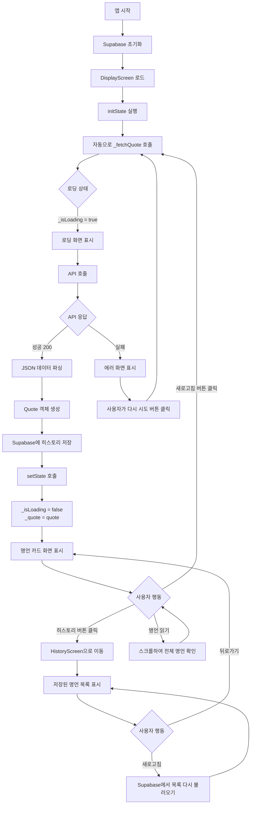
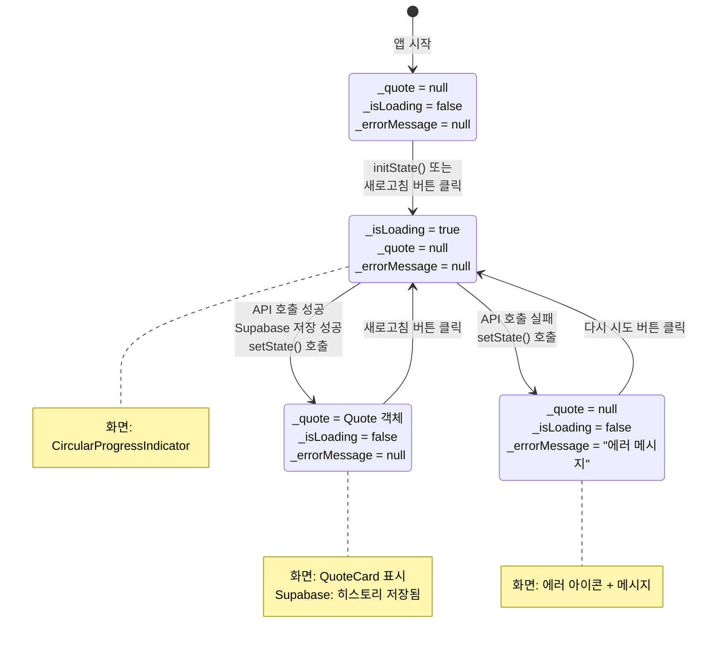
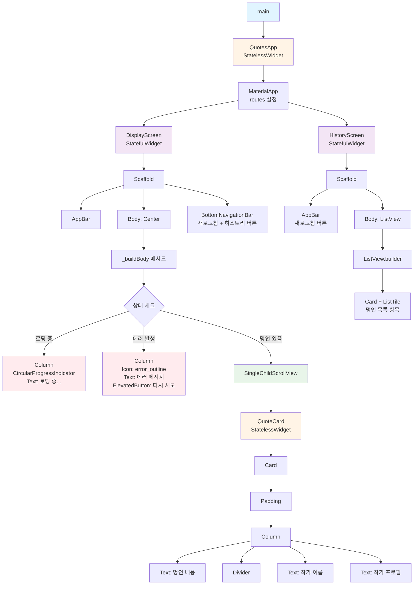
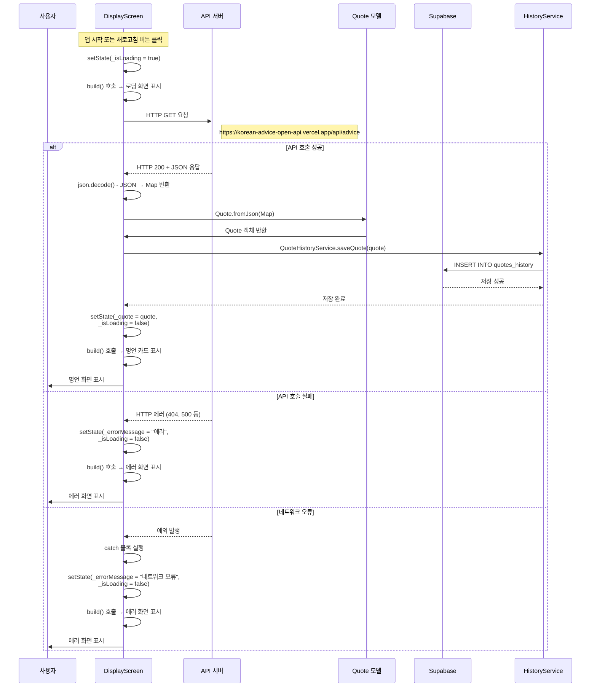
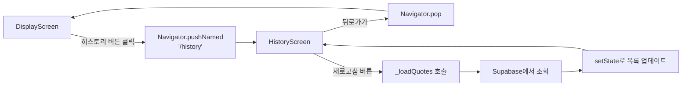

# Flutter 명언 앱 코드 구조 설명

## 📚 목차
1. [프로젝트 개요](#프로젝트-개요)
2. [파일 구조](#파일-구조)
3. [주요 개념](#주요-개념)
4. [다이어그램](#다이어그램)
   - [UX Flow](#1-ux-flow-사용자-흐름)
   - [State Management](#2-state-management-상태-관리-흐름)
   - [Widget Tree](#3-widget-tree-위젯-트리-구조)
   - [API 호출 및 Supabase 저장 플로우](#4-api-호출-및-supabase-저장-플로우)
   - [네비게이션 플로우](#5-네비게이션-플로우)
5. [코드 상세 설명](#코드-상세-설명)
6. [앱 실행 흐름](#앱-실행-흐름)
7. [학습 포인트](#학습-포인트)

---

## 프로젝트 개요

이 앱은 API에서 랜덤한 명언을 가져와 화면에 표시하고, Supabase를 통해 히스토리를 저장/조회하는 Flutter 앱입니다. Flutter의 핵심 개념인 **StatelessWidget**과 **StatefulWidget**을 학습하기 위한 교육용 앱입니다.

### 주요 기능
- API에서 명언 데이터 가져오기
- 명언을 카드 형태로 표시 (Display 화면)
- 새로고침 버튼으로 새로운 명언 불러오기
- 명언 조회 시 자동으로 Supabase에 히스토리 저장
- 히스토리 화면에서 저장된 명언 목록 조회
- 하단에 새로고침 버튼과 히스토리 버튼 배치
- 로딩 상태 및 에러 처리
- 환경 변수를 통한 Supabase key 관리

---

## 파일 구조

```
lib/
├── main.dart                    # 앱의 시작점, Display 화면 및 위젯 정의
├── models/
│   └── quote.dart               # 명언 데이터 모델 클래스
├── config/
│   └── env.dart                 # 환경 변수 관리 클래스
├── services/
│   └── quote_history_service.dart  # Supabase 히스토리 서비스
└── screens/
    └── history_screen.dart      # 히스토리 화면
```

### 파일 역할 요약

| 파일 | 역할 |
|------|------|
| `main.dart` | 앱의 시작점, Display 화면, 네비게이션 설정 |
| `models/quote.dart` | 명언 데이터를 표현하는 클래스 (작가, 작가 프로필, 명언 내용) |
| `config/env.dart` | 환경 변수( Supabase URL, anon key) 관리 |
| `services/quote_history_service.dart` | Supabase를 통한 명언 히스토리 저장/조회 서비스 |
| `screens/history_screen.dart` | 저장된 명언 목록을 표시하는 화면 |
| `.env` | Supabase key 정보를 저장하는 환경 변수 파일 |

---

## 주요 개념

### 1. StatelessWidget vs StatefulWidget

#### StatelessWidget (상태 없는 위젯)
- **특징**: 데이터를 받아서 표시만 함
- **사용 예시**: `QuoteCard`, `QuotesApp`, `QuoteHistoryService`, `Env`
- **특징**:
  - `build()` 메서드만 있음
  - `setState()` 사용 불가
  - 부모로부터 데이터를 받아 표시
  - 상태가 변경되지 않는 유틸리티 클래스로도 사용

#### StatefulWidget (상태 있는 위젯)
- **특징**: 상태를 관리하고 변경할 수 있음
- **사용 예시**: `DisplayScreen`, `HistoryScreen`
- **특징**:
  - `State` 클래스를 별도로 가짐
  - `setState()`로 상태 변경 및 UI 업데이트
  - 상태 변경 시 `build()`가 다시 호출됨

### 2. setState()의 역할

```dart
setState(() {
  _quote = quote;  // 상태 변수 변경
  _isLoading = false;
});
```

- 상태 변수를 변경할 때 사용
- `setState()` 안에서 변수를 변경하면 Flutter가 자동으로 화면을 다시 그림
- `setState()` 없이 변수만 변경하면 화면이 업데이트되지 않음

### 3. 네비게이션

```dart
Navigator.pushNamed(context, '/history');
```

- 화면 간 이동을 위한 Flutter의 네비게이션 시스템
- `MaterialApp`의 `routes`로 화면 경로를 정의
- `pushNamed()`로 다른 화면으로 이동

### 4. Supabase 연동

- Supabase는 백엔드 서비스로 데이터베이스 기능 제공
- `supabase_flutter` 패키지를 통해 Flutter 앱과 연동
- 환경 변수로 API key를 안전하게 관리

---

## 다이어그램

### 1. UX Flow (사용자 흐름)

사용자가 앱을 사용하는 전체 흐름을 보여줍니다.



### 2. State Management (상태 관리 흐름)

앱의 상태가 어떻게 관리되고 변경되는지 보여줍니다.



### 3. Widget Tree (위젯 트리 구조)

위젯들이 어떻게 중첩되어 있는지 보여줍니다.



### 4. API 호출 및 Supabase 저장 플로우

API 호출과 Supabase 저장 과정을 상세히 보여줍니다.



### 5. 네비게이션 플로우

화면 간 이동 흐름을 보여줍니다.



---

## 코드 상세 설명

### 📁 models/quote.dart

이 파일은 API에서 받은 JSON 데이터를 Dart 객체로 변환하는 역할을 합니다.

```dart
class Quote {
  final String author;           // 작가 이름
  final String authorProfile;    // 작가 프로필
  final String message;          // 명언 내용
}
```

**왜 필요한가요?**
- API는 JSON 형식으로 데이터를 보냅니다
- Dart에서는 객체 형태로 데이터를 다루는 것이 편리합니다
- `fromJson()` 메서드로 JSON → Dart 객체 변환

**예시**:
```dart
// API 응답 (JSON)
{
  "author": "에이브러햄 링컨",
  "authorProfile": "미국 16대 대통령",
  "message": "자유는 결코 인간이 타고난 것이 아니다..."
}

// Quote.fromJson()으로 변환하면
Quote(
  author: "에이브러햄 링컨",
  authorProfile: "미국 16대 대통령",
  message: "자유는 결코 인간이 타고난 것이 아니다..."
)
```

---

### 📁 config/env.dart

환경 변수를 관리하는 클래스입니다. StatelessWidget 개념을 보여주는 예시로, 상태가 없는 유틸리티 클래스입니다.

```dart
class Env {
  Env._();  // private 생성자
  
  static String get supabaseUrl {
    return dotenv.env['SUPABASE_URL'] ?? '';
  }
  
  static String get supabaseAnonKey {
    return dotenv.env['SUPABASE_ANON_KEY'] ?? '';
  }
}
```

**역할**:
- `.env` 파일에서 Supabase URL과 anon key를 읽어옵니다
- 모든 메서드가 `static`이므로 인스턴스 생성 없이 사용 가능합니다
- StatelessWidget처럼 상태가 없는 유틸리티 클래스입니다

**왜 StatelessWidget 개념인가?**
- 상태를 가지지 않고, 설정된 값을 읽기만 합니다
- 한 번 로드되면 변경되지 않는 값들을 관리합니다

---

### 📁 services/quote_history_service.dart

Supabase를 통해 명언 히스토리를 저장하고 조회하는 서비스 클래스입니다.

```dart
class QuoteHistoryService {
  QuoteHistoryService._();  // private 생성자
  
  static Future<void> saveQuote(Quote quote) async {
    await _supabase.from('quotes_history').insert({
      'author': quote.author,
      'author_profile': quote.authorProfile,
      'message': quote.message,
    });
  }
  
  static Future<List<Map<String, dynamic>>> getQuotes() async {
    final response = await _supabase
        .from('quotes_history')
        .select()
        .order('created_at', ascending: false);
    return List<Map<String, dynamic>>.from(response);
  }
}
```

**역할**:
- `saveQuote()`: 명언을 Supabase의 `quotes_history` 테이블에 저장
- `getQuotes()`: 저장된 명언 목록을 최신순으로 조회

**왜 StatelessWidget 개념인가?**
- 상태를 가지지 않고, 데이터를 받아서 처리만 합니다
- 여러 곳에서 재사용 가능한 유틸리티 역할을 합니다

---

### 📁 screens/history_screen.dart

저장된 명언 목록을 표시하는 화면입니다. StatefulWidget으로 구현되어 있습니다.

**주요 기능**:
- Supabase에서 저장된 명언 목록을 조회
- 리스트 형태로 간단한 텍스트로 표시
- 각 항목에 명언 내용, 작가, 저장 날짜/시간 표시
- 새로고침 버튼으로 목록 다시 불러오기

**상태 변수**:
```dart
List<Map<String, dynamic>> _quotes = [];  // 저장된 명언 목록
bool _isLoading = false;                   // 로딩 중인지 여부
String? _errorMessage;                     // 에러 메시지
```

**왜 StatefulWidget인가?**
- Supabase에서 데이터를 가져와서 상태로 관리합니다
- `setState()`로 목록을 업데이트하고 UI를 갱신합니다

---

### 📁 main.dart

앱의 시작점이며 Display 화면과 주요 위젯들이 정의되어 있습니다.

#### 1. `main()` 함수

```dart
Future<void> main() async {
  WidgetsFlutterBinding.ensureInitialized();
  
  // .env 파일 로드
  await dotenv.load(fileName: '.env');
  
  // Supabase 초기화
  await Supabase.initialize(
    url: Env.supabaseUrl,
    anonKey: Env.supabaseAnonKey,
  );
  
  runApp(const QuotesApp());
}
```

**역할**:
- Flutter 앱의 시작점
- 환경 변수 로드 및 Supabase 초기화
- `async` 함수로 비동기 초기화 작업 수행

#### 2. `QuotesApp` - StatelessWidget

```dart
class QuotesApp extends StatelessWidget {
  @override
  Widget build(BuildContext context) {
    return MaterialApp(
      title: '오늘의 명언',
      theme: ThemeData(...),
      initialRoute: '/',
      routes: {
        '/': (context) => const DisplayScreen(),
        '/history': (context) => const HistoryScreen(),
      },
    );
  }
}
```

**역할**:
- 앱의 전체 설정 (테마, 제목 등)
- 네비게이션 routes 설정
- Display 화면과 History 화면 간 이동 경로 정의

#### 3. `QuoteCard` - StatelessWidget

```dart
class QuoteCard extends StatelessWidget {
  final Quote quote;  // 명언 데이터를 받음
  
  Widget build(BuildContext context) {
    return Card(
      child: Column(
        children: [
          Text(quote.message),    // 명언 내용
          Text(quote.author),      // 작가 이름
          Text(quote.authorProfile), // 작가 프로필
        ],
      ),
    );
  }
}
```

**역할**:
- 받은 명언 데이터를 카드 형태로 표시
- 부모 위젯으로부터 데이터를 받아서 표시만 함

#### 4. `DisplayScreen` - StatefulWidget

가장 중요한 위젯입니다. 상태 관리와 API 호출, Supabase 저장을 담당합니다.

**구조**:
```
DisplayScreen (StatefulWidget)
  └─ _DisplayScreenState (State 클래스)
       ├─ 상태 변수들
       ├─ initState()
       ├─ _fetchQuote()
       ├─ _navigateToHistory()
       ├─ build()
       └─ _buildBody()
```

##### 상태 변수

```dart
Quote? _quote;              // 현재 명언 (없을 수 있음 = null)
bool _isLoading = false;    // 로딩 중인지 여부
String? _errorMessage;      // 에러 메시지
```

##### _fetchQuote() 메서드

가장 중요한 메서드입니다. API에서 명언을 가져오고 Supabase에 저장합니다.

**흐름 설명**:

1. **로딩 시작**
   ```dart
   setState(() {
     _isLoading = true;
     _errorMessage = null;
   });
   ```

2. **API 호출**
   ```dart
   final response = await http.get(
     Uri.parse('https://korean-advice-open-api.vercel.app/api/advice'),
   );
   ```

3. **응답 확인 및 변환**
   ```dart
   if (response.statusCode == 200) {
     final jsonData = json.decode(response.body);
     final quote = Quote.fromJson(jsonData);
   }
   ```

4. **Supabase에 저장**
   ```dart
   try {
     await QuoteHistoryService.saveQuote(quote);
   } catch (e) {
     debugPrint('명언 저장 실패: $e');
   }
   ```
   - 저장 실패해도 화면 표시에는 영향을 주지 않도록 처리

5. **상태 업데이트**
   ```dart
   setState(() {
     _quote = quote;
     _isLoading = false;
   });
   ```

##### 하단 버튼 레이아웃

```dart
bottomNavigationBar: SafeArea(
  child: Padding(
    padding: const EdgeInsets.all(16.0),
    child: Row(
      children: [
        Expanded(
          child: ElevatedButton.icon(
            onPressed: _isLoading ? null : _fetchQuote,
            icon: const Icon(Icons.refresh),
            label: const Text('새로고침'),
          ),
        ),
        const SizedBox(width: 12),
        Expanded(
          child: ElevatedButton.icon(
            onPressed: _navigateToHistory,
            icon: const Icon(Icons.history),
            label: const Text('히스토리'),
          ),
        ),
      ],
    ),
  ),
),
```

**역할**:
- 새로고침 버튼: 새로운 명언을 가져옵니다
- 히스토리 버튼: History 화면으로 이동합니다
- `Row`로 두 버튼을 나란히 배치합니다

---

## 앱 실행 흐름

### 1. 앱 시작 및 초기화

```
main() 
  → WidgetsFlutterBinding.ensureInitialized()
  → dotenv.load('.env')
  → Supabase.initialize()
  → runApp(QuotesApp())
    → QuotesApp.build()
      → MaterialApp(routes 설정)
```

### 2. DisplayScreen 초기화

```
DisplayScreen 생성
  → _DisplayScreenState.initState() 호출
    → _fetchQuote() 자동 실행
```

### 3. 명언 불러오기 및 저장

```
_fetchQuote()
  → setState(_isLoading = true)  // 로딩 표시
  → HTTP GET 요청 (API 호출)
  → 응답 받기
  → JSON → Quote 객체 변환
  → QuoteHistoryService.saveQuote()  // Supabase에 저장
  → setState(_quote = quote, _isLoading = false)  // 명언 표시
```

### 4. 화면 업데이트

```
setState() 호출
  → build() 다시 실행
    → _buildBody() 호출
      → _quote != null 확인
        → QuoteCard로 명언 표시
```

### 5. 히스토리 화면 이동

```
히스토리 버튼 클릭
  → Navigator.pushNamed('/history')
    → HistoryScreen 생성
      → _HistoryScreenState.initState()
        → _loadQuotes() 자동 실행
          → QuoteHistoryService.getQuotes()
            → Supabase에서 목록 조회
              → setState()로 목록 업데이트
                → ListView로 목록 표시
```

---

## 학습 포인트

### ✅ StatelessWidget
- `QuoteCard`: 데이터를 받아서 표시만 함
- `QuotesApp`: 앱 설정은 변경되지 않음
- `QuoteHistoryService`: 데이터 처리만 하는 서비스 클래스
- `Env`: 환경 변수 읽기만 하는 유틸리티 클래스

### ✅ StatefulWidget
- `DisplayScreen`: 상태를 관리하고 변경함 (명언 조회, 저장)
- `HistoryScreen`: 상태를 관리하고 변경함 (히스토리 목록 조회)
- `setState()`로 상태 변경 시 UI 자동 업데이트

### ✅ 비동기 프로그래밍
- `async/await`: 시간이 걸리는 작업(API 호출, Supabase 작업) 처리
- `Future`: 나중에 결과가 나올 작업

### ✅ 상태 관리
- 상태 변수: `_quote`, `_isLoading`, `_errorMessage`, `_quotes`
- `setState()`: 상태 변경 시 화면 업데이트

### ✅ 조건부 렌더링
- `if` 문으로 상태에 따라 다른 UI 표시
- 로딩/에러/성공 상태별로 다른 화면

### ✅ 네비게이션
- `MaterialApp`의 `routes`로 화면 경로 정의
- `Navigator.pushNamed()`로 화면 이동
- `Navigator.pop()`으로 이전 화면으로 돌아가기

### ✅ Supabase 연동
- 환경 변수로 API key 관리
- Supabase 클라이언트를 통한 데이터 저장/조회
- 비동기 작업으로 데이터베이스 작업 처리

### ✅ 위젯 구성
- 작은 위젯을 조합하여 큰 화면 만들기
- `QuoteCard`를 재사용 가능한 컴포넌트로 만들기
- 화면을 별도 파일로 분리하여 구조화

---

## 코드 읽는 팁

1. **위에서 아래로 읽기**: `main()` → `QuotesApp` → `DisplayScreen` → `HistoryScreen` 순서
2. **주석 읽기**: 코드에 자세한 설명이 있습니다
3. **함수 이름으로 이해하기**: 
   - `_fetchQuote()`는 "명언 가져오기"
   - `_navigateToHistory()`는 "히스토리로 이동"
   - `_loadQuotes()`는 "명언 목록 불러오기"
4. **setState() 찾기**: 상태 변경이 어디서 일어나는지 확인
5. **위젯 트리 그리기**: 위젯이 어떻게 중첩되어 있는지 시각화
6. **네비게이션 흐름 추적**: 화면 간 이동 경로를 따라가기
7. **Supabase 작업 추적**: 데이터 저장/조회가 어디서 일어나는지 확인

---

## 다음 단계

이 코드를 이해했다면 다음을 시도해보세요:

1. **UI 개선**: 색상, 폰트, 레이아웃 변경
2. **기능 추가**: 
   - 히스토리에서 명언 삭제 기능
   - 즐겨찾기 기능
   - 명언 검색 기능
3. **다른 위젯 학습**: `ListView`, `GridView`, `BottomNavigationBar` 등
4. **상태 관리 패키지**: Provider, Riverpod, Bloc 등
5. **Supabase 고급 기능**: 
   - 사용자 인증
   - 실시간 업데이트
   - 필터링 및 정렬

---

## 질문이 있나요?

코드를 이해하는 가장 좋은 방법은 직접 실행해보고 수정해보는 것입니다. 
각 부분을 조금씩 변경해보면서 어떤 변화가 일어나는지 관찰해보세요!
