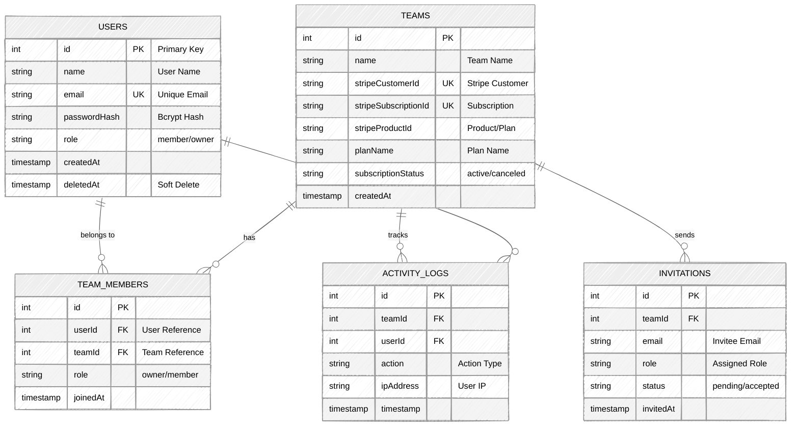

# Application Flow - Next.js SaaS Starter

This document contains the flow diagrams for the SaaS starter application, from high-level overview to detailed flows.

## High-Level Application Overview


## User Journey by Role

```mermaid
---
config:
  layout: dagre
  look: handDrawn
  theme: neutral
---
flowchart LR
    %% New User Journey
    subgraph NewUser["👤 New User Journey"]
        direction TB
        N1["1. Visit Site"]
        N2["2. Sign Up"]
        N3["3. Create Team<br/>(Becomes Owner)"]
        N4["4. Browse Pricing"]
        N5["5. Subscribe"]
        N6["6. Invite Members"]
        
        N1 --> N2 --> N3 --> N4 --> N5 --> N6
    end
    
    %% Invited User Journey
    subgraph InvitedUser["✉️ Invited User Journey"]
        direction TB
        I1["1. Receive Invite"]
        I2["2. Sign Up with Invite"]
        I3["3. Join Team<br/>(As Member)"]
        I4["4. Access Dashboard"]
        
        I1 --> I2 --> I3 --> I4
    end
    
    %% Owner Actions
    subgraph Owner["👑 Owner Actions"]
        direction TB
        O1["• Manage Subscription"]
        O2["• Invite Members"]
        O3["• Remove Members"]
        O4["• View Activity"]
    end
    
    %% Member Actions
    subgraph Member["👥 Member Actions"]
        direction TB
        M1["• Update Profile"]
        M2["• Change Password"]
        M3["• View Team"]
        M4["• View Activity"]
    end
    
    N6 -.->|Creates Invite| I1
    N3 --> Owner
    I3 --> Member
    
    style NewUser fill:#e1f5e1
    style InvitedUser fill:#e3f2fd
    style Owner fill:#fff3e0
    style Member fill:#f3e5f5
```



## Core Flows Summary

```mermaid
---
config:
  layout: elk
  look: handDrawn
  theme: neutral
  elk:
    nodePlacementStrategy: SIMPLE
---
flowchart TB
    %% Authentication
    subgraph Auth["🔐 Authentication - lib/auth/"]
        direction LR
        A1["Email + Password<br/>app/(login)/actions.ts"] --> A2["bcrypt Hash/Verify<br/>session.ts"] --> A3["JWT Token<br/>jose library"] --> A4["httpOnly Cookie<br/>setSession()"]
    end
    
    %% Payment
    subgraph Payment["💳 Payment - lib/payments/ & app/api/stripe/"]
        direction LR
        P1["Select Plan<br/>pricing/page.tsx"] --> P2["Stripe Checkout<br/>actions.ts"] --> P3["Success Callback<br/>checkout/route.ts"] --> P4["Update Team DB<br/>lib/db/queries.ts"]
        P5["Manage Button<br/>dashboard/page.tsx"] --> P6["Stripe Portal<br/>actions.ts"] --> P7["Change Webhook<br/>webhook/route.ts"] --> P4
    end
    
    %% Team
    subgraph TeamMgmt["👥 Team Management - app/(login)/actions.ts"]
        direction LR
        T1["inviteTeamMember()"] --> T2["Create Invitation<br/>lib/db/queries.ts"] --> T3["User Signs Up<br/>with inviteId"] --> T4["Add to Team<br/>team_members"]
        T5["removeTeamMember()"] --> T6["Delete Record<br/>lib/db/queries.ts"]
    end
    
    %% Middleware
    Request["📨 Every Request to<br/>/dashboard/*"] --> Middleware{"🛡️ Middleware<br/>middleware.ts"}
    Middleware -->|"Valid Session"| Allow["✅ Allow Access<br/>lib/auth/middleware.ts"]
    Middleware -->|"No/Invalid Session"| Deny["❌ Redirect to /sign-in"]
    Middleware -->|"GET Request"| Refresh["🔄 Refresh Token<br/>updateSession() +1 day"]
    
    Auth --> Allow
    
    style Auth fill:#c8e6c9
    style Payment fill:#ffe0b2
    style TeamMgmt fill:#e3f2fd
    style Middleware fill:#f3e5f5
    style Allow fill:#e1f5e1
    style Deny fill:#ffcdd2
```



## File Structure & Key Actions

```mermaid
---
config:
  layout: elk
  look: handDrawn
  theme: neutral
---
flowchart TB
    %% Pages
    subgraph Pages["📄 Pages (UI)"]
        direction TB
        P1["app/(dashboard)/page.tsx<br/>Landing Page"]
        P2["app/(login)/sign-in/page.tsx<br/>Sign In Form"]
        P3["app/(login)/sign-up/page.tsx<br/>Sign Up Form"]
        P4["app/(dashboard)/pricing/page.tsx<br/>Pricing Plans"]
        P5["app/(dashboard)/dashboard/page.tsx<br/>Team Settings"]
        P6["app/(dashboard)/dashboard/general/page.tsx<br/>General Settings"]
        P7["app/(dashboard)/dashboard/security/page.tsx<br/>Security Settings"]
        P8["app/(dashboard)/dashboard/activity/page.tsx<br/>Activity Log"]
    end
    
    %% Server Actions
    subgraph Actions["⚡ Server Actions"]
        direction TB
        A1["app/(login)/actions.ts<br/>• signIn()<br/>• signUp()<br/>• signOut()<br/>• updateAccount()<br/>• updatePassword()<br/>• deleteAccount()<br/>• inviteTeamMember()<br/>• removeTeamMember()"]
        A2["lib/payments/actions.ts<br/>• createCheckoutSession()<br/>• createCustomerPortalSession()<br/>• handleSubscriptionChange()"]
    end
    
    %% API Routes
    subgraph API["🔌 API Routes"]
        direction TB
        API1["app/api/user/route.ts<br/>GET current user"]
        API2["app/api/team/route.ts<br/>GET team + members"]
        API3["app/api/stripe/checkout/route.ts<br/>GET process checkout success"]
        API4["app/api/stripe/webhook/route.ts<br/>POST Stripe webhooks"]
    end
    
    %% Auth & Middleware
    subgraph Auth["🔐 Authentication"]
        direction TB
        Auth1["middleware.ts<br/>Route protection"]
        Auth2["lib/auth/middleware.ts<br/>verifySession()<br/>withTeam()"]
        Auth3["lib/auth/session.ts<br/>• createToken()<br/>• verifyToken()<br/>• setSession()<br/>• deleteSession()<br/>• updateSession()"]
    end
    
    %% Database
    subgraph DB["🗄️ Database"]
        direction TB
        DB1["lib/db/schema.ts<br/>Tables:<br/>• users<br/>• teams<br/>• team_members<br/>• invitations<br/>• activity_logs"]
        DB2["lib/db/queries.ts<br/>• getUser()<br/>• getTeamForUser()<br/>• updateTeamSubscription()<br/>• getActivityLogs()"]
        DB3["lib/db/drizzle.ts<br/>Database connection"]
    end
    
    %% External Services
    subgraph External["🌐 External Services"]
        direction TB
        E1["lib/payments/stripe.ts<br/>Stripe client config"]
    end
    
    %% Connections
    P2 --> A1
    P3 --> A1
    P5 --> A1
    P6 --> A1
    P7 --> A1
    
    P4 --> A2
    P5 --> A2
    
    Pages -.-> API
    
    A1 --> Auth3
    A2 --> E1
    
    Auth1 --> Auth2
    Auth2 --> Auth3
    
    Auth3 --> DB2
    A1 --> DB2
    A2 --> DB2
    API --> DB2
    
    DB2 --> DB3
    DB2 --> DB1
    
    API3 --> E1
    API4 --> E1
    API4 --> A2
    
    style Pages fill:#e3f2fd
    style Actions fill:#fff3e0
    style API fill:#c8e6c9
    style Auth fill:#f3e5f5
    style DB fill:#e1f5e1
    style External fill:#ffe0b2
```



## Complete Application Flow (Detailed)


## Tech Stack Integration

```mermaid
---
config:
  layout: elk
  look: handDrawn
  theme: neutral
---
flowchart TB
    %% Frontend
    subgraph Frontend["⚛️ Frontend (Next.js 15)"]
        Pages["📄 Pages<br/>app/**/*.tsx"]
        Components["🎨 UI Components<br/>components/ui/*.tsx<br/>(shadcn/ui)"]
        Actions["⚡ Server Actions<br/>app/(login)/actions.ts"]
    end
    
    %% Backend
    subgraph Backend["🔧 Backend Services"]
        API["🔌 API Routes<br/>app/api/**/route.ts"]
        Middleware["🛡️ Middleware<br/>middleware.ts<br/>lib/auth/middleware.ts"]
        Auth["🔐 JWT Auth<br/>lib/auth/session.ts<br/>(jose library)"]
    end
    
    %% Database
    subgraph Database["🗄️ Database Layer"]
        Drizzle["📊 Drizzle ORM<br/>lib/db/drizzle.ts<br/>lib/db/queries.ts"]
        Schema["📋 Schema<br/>lib/db/schema.ts"]
        Postgres["🐘 PostgreSQL<br/>(postgres package)"]
    end
    
    %% External
    subgraph External["🌐 External Services"]
        Stripe["💳 Stripe API<br/>lib/payments/stripe.ts<br/>- Checkout<br/>- Portal<br/>- Webhooks"]
    end
    
    %% Connections
    Pages --> Actions
    Pages --> Components
    Actions --> API
    Actions --> Auth
    
    API --> Middleware
    Middleware --> Auth
    
    Auth --> Drizzle
    API --> Drizzle
    Actions --> Drizzle
    Drizzle --> Schema
    Schema --> Postgres
    
    API <--> Stripe
    Actions <--> Stripe
    
    style Frontend fill:#e3f2fd
    style Backend fill:#fff3e0
    style Database fill:#c8e6c9
    style External fill:#ffe0b2
```



## Authentication Flow Detail


## Payment Flow Detail


## Database Schema Relations



## Key Features Summary

### 1. Authentication
- Email/password authentication with bcrypt hashing
- JWT tokens stored in httpOnly cookies
- Session refresh on GET requests (extends 1 day)
- Global middleware protection for `/dashboard` routes

### 2. Team Management
- Owner and Member roles (RBAC)
- Team creation on sign-up
- Member invitation system
- Member removal (owner only)

### 3. Payments
- Stripe Checkout integration
- Customer Portal for subscription management
- Webhook handling for subscription updates
- Subscription status synced to database

### 4. User Settings
- Account info updates (name, email)
- Password change with validation
- Soft delete account (adds suffix to email)

### 5. Activity Logging
- Tracks all major user actions
- Stores: user, team, action type, IP, timestamp
- Displays recent 10 activities

### 6. API Routes
- `/api/user` - Get current user
- `/api/team` - Get current team with members
- `/api/stripe/webhook` - Handle Stripe events
- `/api/stripe/checkout` - Process successful checkout

---

## Quick Reference: File Locations

### 📄 Pages (Frontend UI)

| Route | File | Purpose |
|-------|------|---------|
| `/` | `app/(dashboard)/page.tsx` | Landing page with terminal animation |
| `/pricing` | `app/(dashboard)/pricing/page.tsx` | Pricing plans and subscription options |
| `/sign-in` | `app/(login)/sign-in/page.tsx` | Sign in form |
| `/sign-up` | `app/(login)/sign-up/page.tsx` | Sign up form with optional invite |
| `/dashboard` | `app/(dashboard)/dashboard/page.tsx` | Team settings (members, subscription) |
| `/dashboard/general` | `app/(dashboard)/dashboard/general/page.tsx` | Account settings (name, email) |
| `/dashboard/security` | `app/(dashboard)/dashboard/security/page.tsx` | Security settings (password, delete) |
| `/dashboard/activity` | `app/(dashboard)/dashboard/activity/page.tsx` | Activity log viewer |

### ⚡ Server Actions

| File | Functions | Purpose |
|------|-----------|---------|
| `app/(login)/actions.ts` | `signIn()`, `signUp()`, `signOut()` | Authentication actions |
| | `updateAccount()`, `updatePassword()`, `deleteAccount()` | Account management |
| | `inviteTeamMember()`, `removeTeamMember()` | Team management |
| `lib/payments/actions.ts` | `createCheckoutSession()` | Create Stripe checkout |
| | `createCustomerPortalSession()` | Open Stripe portal |
| | `handleSubscriptionChange()` | Process webhook updates |

### 🔌 API Routes

| Route | File | Method | Purpose |
|-------|------|--------|---------|
| `/api/user` | `app/api/user/route.ts` | GET | Get current user data |
| `/api/team` | `app/api/team/route.ts` | GET | Get team with members |
| `/api/stripe/checkout` | `app/api/stripe/checkout/route.ts` | GET | Process checkout success callback |
| `/api/stripe/webhook` | `app/api/stripe/webhook/route.ts` | POST | Handle Stripe webhook events |

### 🔐 Authentication & Middleware

| File | Functions/Purpose |
|------|-------------------|
| `middleware.ts` | Global middleware - protects `/dashboard/*` routes |
| `lib/auth/middleware.ts` | `verifySession()` - Validates JWT tokens<br/>`withTeam()` - Team context wrapper |
| `lib/auth/session.ts` | `createToken()` - Generate JWT<br/>`verifyToken()` - Validate JWT<br/>`setSession()` - Set cookie<br/>`deleteSession()` - Clear cookie<br/>`updateSession()` - Refresh token |

### 🗄️ Database Layer

| File | Purpose |
|------|---------|
| `lib/db/schema.ts` | Database schema definitions:<br/>- `users`, `teams`, `team_members`<br/>- `invitations`, `activity_logs` |
| `lib/db/queries.ts` | Database query functions:<br/>- `getUser()`, `getTeamForUser()`<br/>- `updateTeamSubscription()`<br/>- `getActivityLogs()` |
| `lib/db/drizzle.ts` | Drizzle ORM client configuration |
| `lib/db/setup.ts` | Database setup script |
| `lib/db/seed.ts` | Database seeding script |

### 💳 Payments (Stripe)

| File | Functions/Purpose |
|------|-------------------|
| `lib/payments/stripe.ts` | Stripe client initialization and configuration |
| `lib/payments/actions.ts` | Payment-related server actions (checkout, portal, webhooks) |

### 🎨 UI Components

| Directory | Purpose |
|-----------|---------|
| `components/ui/*.tsx` | shadcn/ui components:<br/>- `button.tsx`, `input.tsx`, `card.tsx`<br/>- `dropdown-menu.tsx`, `avatar.tsx`, etc. |

### ⚙️ Configuration

| File | Purpose |
|------|---------|
| `middleware.ts` | Next.js middleware entry point |
| `next.config.ts` | Next.js configuration |
| `drizzle.config.ts` | Drizzle ORM configuration |
| `.env.example` | Environment variables template |

---

## How to Make Changes

### Adding a New Page
1. Create page in `app/` directory following route structure
2. Add to dashboard layout if protected: `app/(dashboard)/dashboard/YOUR_PAGE/page.tsx`

### Adding a New Server Action
1. Add function to `app/(login)/actions.ts` (for auth/account/team)
2. Or `lib/payments/actions.ts` (for payment-related)
3. Use `withAuth()` or `withTeam()` wrappers for authentication
4. Validate input with Zod schemas

### Modifying Authentication
1. JWT logic: `lib/auth/session.ts`
2. Middleware protection: `middleware.ts` and `lib/auth/middleware.ts`
3. Session duration: Update token expiry in `createToken()`

### Changing Database Schema
1. Update schema: `lib/db/schema.ts`
2. Generate migration: `pnpm db:generate`
3. Run migration: `pnpm db:migrate`
4. Update queries: `lib/db/queries.ts`

### Modifying Payment Flow
1. Checkout: `lib/payments/actions.ts` → `createCheckoutSession()`
2. Success callback: `app/api/stripe/checkout/route.ts`
3. Webhooks: `app/api/stripe/webhook/route.ts`
4. Portal: `lib/payments/actions.ts` → `createCustomerPortalSession()`

### Adding Activity Logging
Add logging calls in server actions using the activity log pattern:
```typescript
await db.insert(activityLogs).values({
  teamId: team.id,
  userId: user.id,
  action: 'your_action_type',
  ipAddress: headers().get('x-forwarded-for') || 'unknown',
});
```
